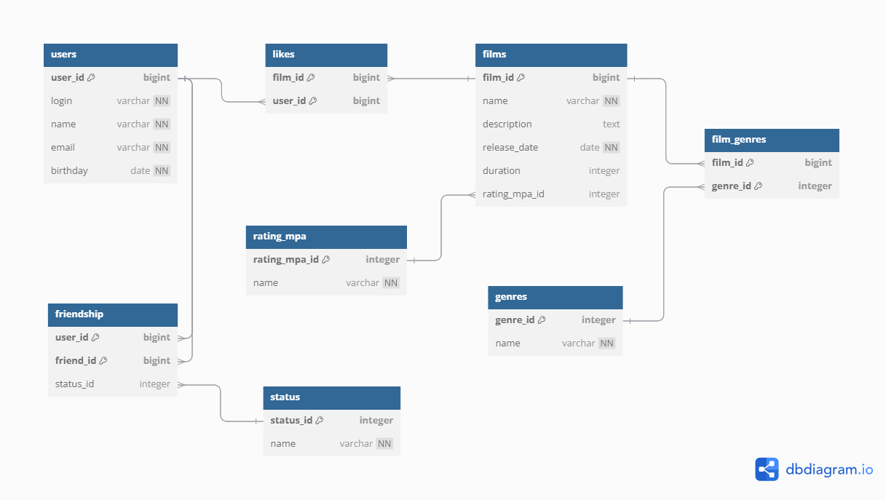

# Filmorate (Solo Project)

A Java backend application for managing films and user interactions: likes, friendships, film ratings, and genres.  

This was my first experience building a structured REST API with validation, layered architecture, and testable business logic, 
implemented as a solo project as part of a training program.
Later, using a similar codebase developed by another student as a reference,
a team of four (including me) built a group version.
That team project is published in a separate repository labeled “group”

## Features
- Add, update, delete, and retrieve users and films
- Validate user login, email, and film release date
- Like/unlike films and get top-N most popular films
- Add/remove friends and get mutual friends

## Technologies Used
- Java 21
- Spring Boot (Web, Validation)
- H2 (file‑based) database · JdbcTemplate repositories
- Maven
- Lombok
- JUnit (unit tests)
- Checkstyle (code style)

## Data Base

- `users(user_id, login, name, email, birthday)`
- `films(film_id, name, description, release_date, duration, rating_mpa_id)`
- `rating_mpa(rating_mpa_id, name)`
- `genres(genre_id, name) · film_genres(film_id, genre_id)`
- `likes(film_id, user_id)`
- `status(status_id, name)`
- `friendship(user_id, friend_id, status_id)`

## Project Structure
```
src/main/java/ru/yandex/practicum/filmorate/
├── controller/             # REST controllers
├── exception/              # Custom exceptions and error handling
├── model/                  # Domain models
├── repository/             # JDBC repositories (DAOs) by aggregate
│   ├── film/
│   ├── genre/
│   ├── mpa/
│   └── user/
├── service/                # Business services by domain
│   ├── film/
│   ├── genre/
│   ├── mpa/
│   └── user/
└── validation/             # Custom validators

src/main/resources/
├── application.properties  # H2 file DB config + H2 console
├── schema.sql              # DDL
└── data.sql                # Seed data
```


## Main Endpoints

### Users
- `GET /users` - get all users
- `POST /users` - add user
- `PUT /users` - update user
- `PUT /users/{id}/friends/{friendId}` - add friend
- `DELETE /users/{id}/friends/{friendId}` - remove friend
- `GET /users/{id}/friends` - get user’s friends
- `GET /users/{id}/friends/common/{otherId}` - mutual friends

### Films
- `GET /films` - get all films
- `GET /films/{id}` - get film by ID
- `POST /films` - add film
- `PUT /films` - update film
- `PUT /films/{id}/like/{userId}` - like a film
- `DELETE /films/{id}/like/{userId}` - remove like
- `GET /films/popular` - get most liked films

### Genre
- `GET /genres` - get all genres
- `GET /genres/{id}` - get genre by id

### Mpa
- `GET /mpa` - get all MPAs
- `GET /mpa/{id}` - get MPA by id

_____ 

## Run application

```bash
mvn spring-boot:run
```